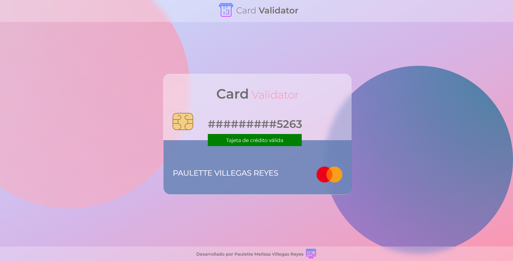
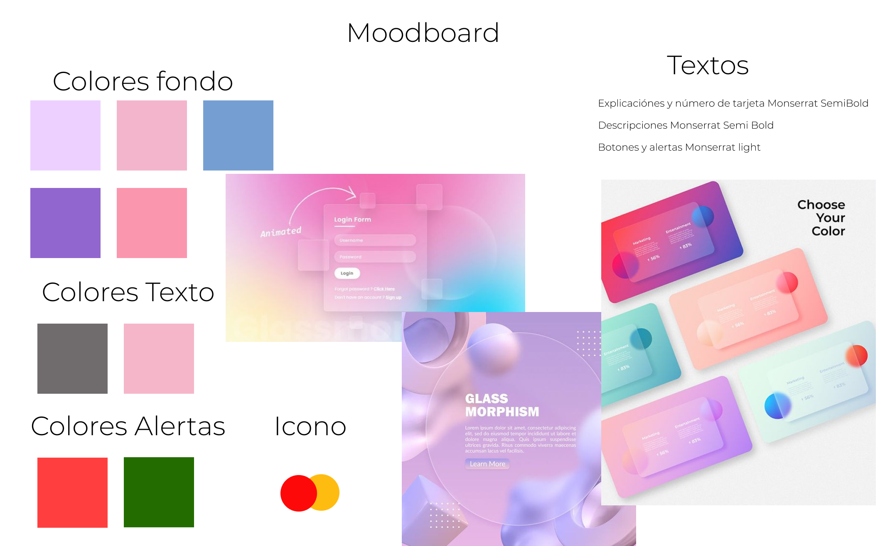
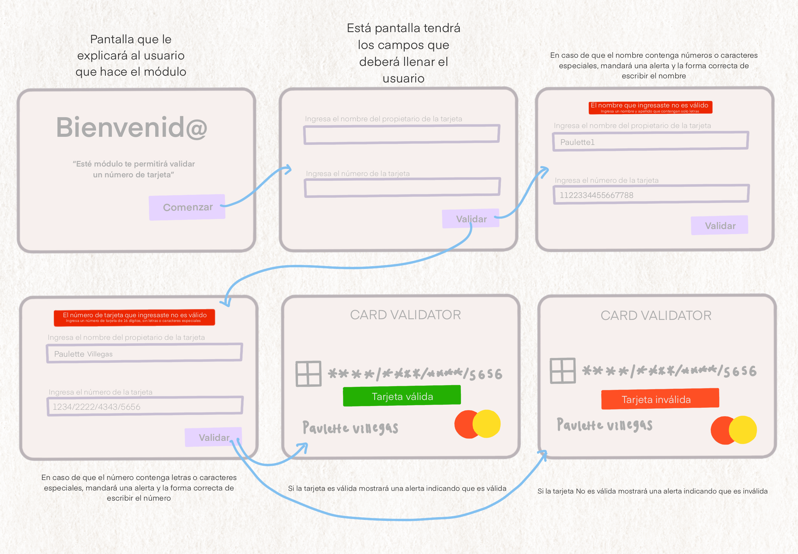
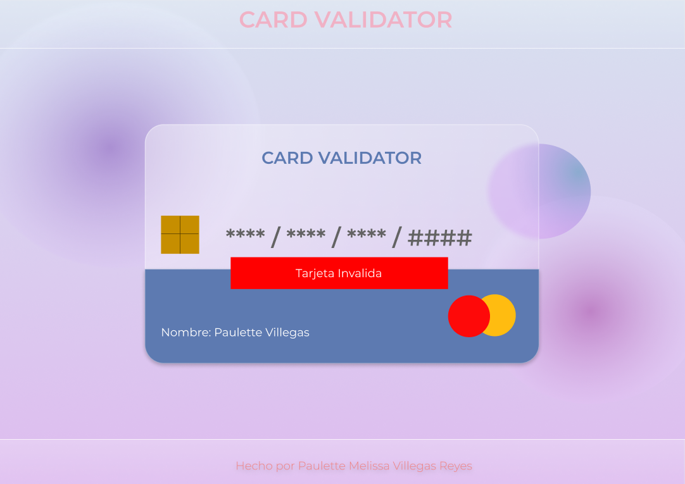

<h1 align='center'>Tarjeta de crédito válida </h1>

 

  &nbsp
  &nbsp
  &nbsp

Credit Card Validation es un sistema web que le permite a un usuario validar un número de tarjeta de acuerdo al algoritmo de Luhn, el cual por medio de una serie de operaciones matemáticas valida si dicho número de tarjeta es válido o no.

fire

Para este proyecto el principal usuario es cualquier persona que por medio del algoritmo de luhn quiera validar un número de tarjeta, como sabemos este algoritmo permite validar números de identificación como:

- Tarjetas de crédito
- IMEI, entre otros.

Por tanto, el principal usuario es aquel que quiera verificar si un número de tarjeta es válido o invalido siguiendo dicho algoritmo.

### ¿Qué problema resuelve?

Este sistema web soluciona la validación de la tarjeta por medio de una interfaz gráfica sencilla de entender, en la que el usuario tendrá que ingresar un número de tarjeta y automáticamente el sistema mandara una alerta indicando si dicho número de tarjeta es válido o no. Esto le ayuda al usuario a hacer la tarea de la validación de una forma rápida y sin errores de cálculo que podrían pasar al realizar el algoritmo de forma manual.

## Enfoques del proyecto

### UX

Para realizar dicho sistema se llevó a cabo un prototipo de baja fidelidad con el que se buscaba:

- Brindarle al usuario una interfaz fácil de comprender
- Un flujo de pantallas optimo y coherente 
- Un prototipo que pudiera ser iterable y creativo

Para lograr que el prototipo fuera claro y funcional seguí los siguientes pasos con un usuario:

- **Empatizar**: consistió en una plática de aproximadamente 15min con un usuario el cual me platico un poco de cómo le gustaría que fuera el proceso de validar la tarjeta y gráficamente la interfaz

- **Definir**: Con la información brindada por el usuario se definió un moodboard visual para la UI del sistema y se enlisto cada cosa que podría ir en el sistema.

- **Idear**: Aquí cree el primer prototipo en papel el cual fue una guía de como quedaría la interfaz de acuerdo a componentes y elementos, y nuestro siguiente paso fue pedir feedback a otros usuarios para mejorar el prototipo, en este feedback obtuvimos: o Juntar las 2 primeras vistas en una sola o Las alertas de los datos incorrectos se verían mejor debajo de los inputs y que solo fueran texto en rojo en vez de un recuadro rojo

- **Prototipar**: Cree un prototipo en Figma el cual representa de manera visual el producto final de la página, esta fue la base para que pudiera comenzar a maquetar el sistema en HTML & CSS

  

- **Probar**: Las pruebas se generaron mientras se le daba funcionalidad al sistema y como complemento se le pidió a un usuario probar la interfaz y poder observar el flujo de trabajo con ella, obteniendo un buen resultado de usabilidad.

- **Feedback**: al tener avanzado el sistema se realizó una Demo en la que la única mejora que se debía hacer era en cambiar el color del botón para que fuera más visible, lo cual fue implementado de manera inmediata.

---

# Prototipo final

### UI

Para hacer el diseño UI del sistema seguí una tendencia de diseño llamado Glassmorphism el cual juega con figuras, degradados y transparencias para simular un cristal, decidí utilizar esta tendencia ya que siento que me permitió plasmar un poco de mi personalidad en el proyecto.

---

# Aprendizajes adquiridos

### HTML & CSS

⌨ Uso de HTML semántico \
⌨ Selectores\
⌨ Box model\
⌨ Posicionamiento con Flexbox\
⌨ Variables \
⌨ Posicionamiento absoluto y relativo

### JAVASCRIPT

🖥 Uso de funciones\
🖥 Manipulacion dinámica del DOM \
🖥 Selectores y eventos del DOM\
🖥 Ciclos (For)\
🖥 Condicionales (If)\
🖥 Uso del LocalStorage\
🖥 Uso de Strings, Array y Objetos\
🖥 Uso de datos primitivos

### EXTRAS

💻 Uso de pruebas unitarias\
💻 Conceptos de UI/UX\
💻 Uso de Git y GitHub\
💻 Markdown
